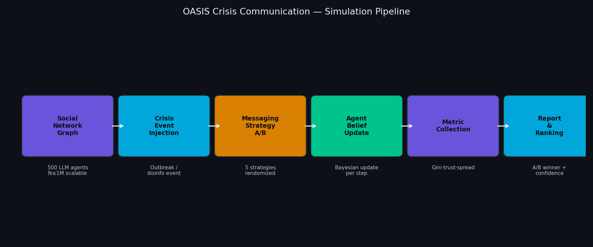
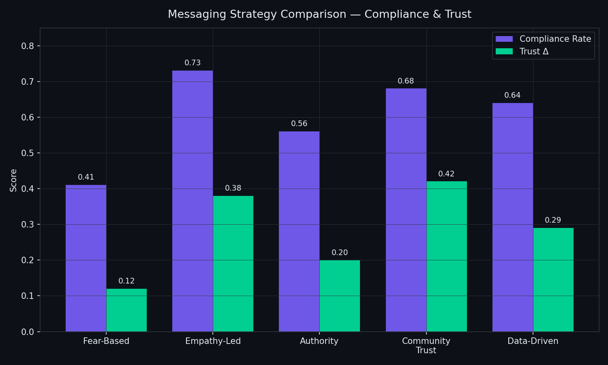
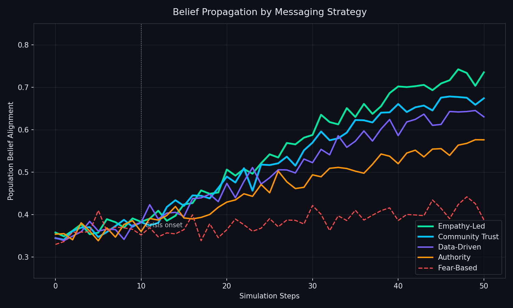
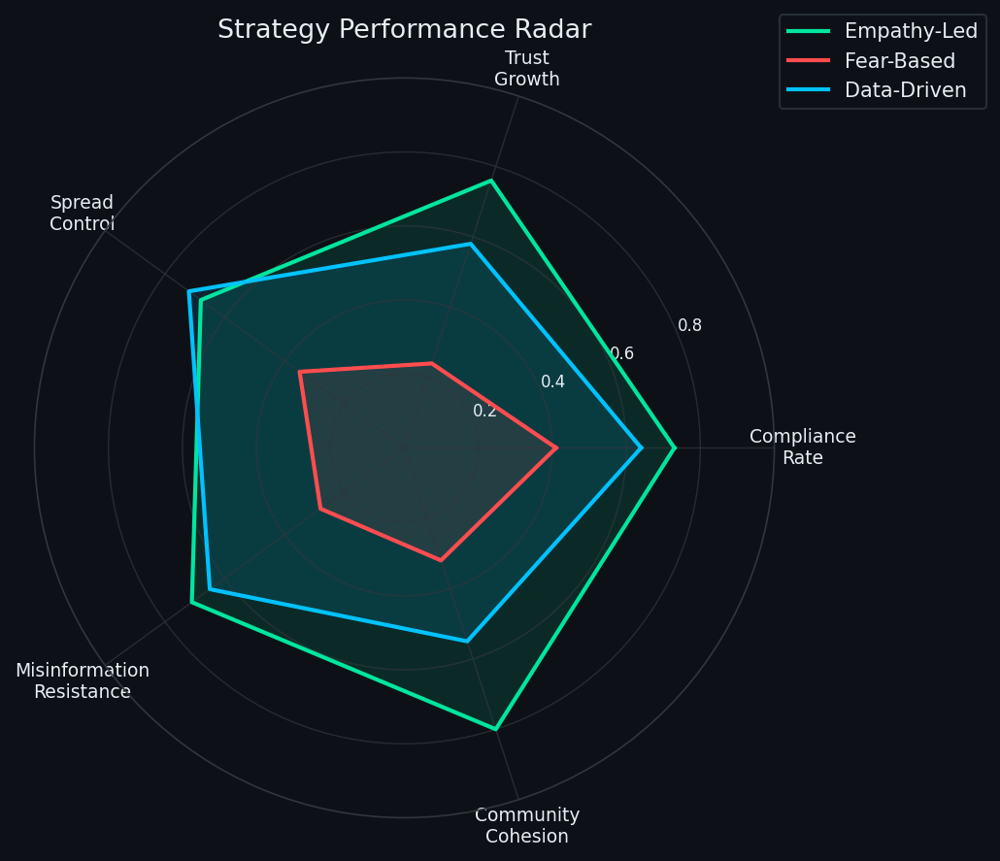

# OASIS Crisis Communication Optimizer – A/B test messaging strategies before the next outbreak

> *Made autonomously using [NEO](https://heyneo.so) — your autonomous AI Agent · [](https://marketplace.visualstudio.com/items?itemName=NeoResearchInc.heyneo)*

[](https://www.python.org/downloads/)
[](https://opensource.org/licenses/MIT)
[](tests/)
[](https://github.com/camel-ai/oasis)

> Simulate 500 LLM agents reacting to a crisis, A/B test 5 messaging strategies, and get a ranked recommendation — before the real-world stakes kick in.

---

## What Problem This Solves

Public health agencies and disaster response teams can't ethically A/B test messaging strategies on real populations during a crisis. Standard agent-based models lack the linguistic nuance of real human reactions, while full LLM deployments cost thousands per run. This tool fills the gap: a reproducible sandbox powered by the CAMEL-AI OASIS framework that simulates how synthetic social networks respond to different tones, timings, and misinformation pressures — at near-zero cost with no API keys required.

---

## How It Works



A synthetic social graph (500 agents with demographic and ideological attributes) receives a crisis event injection. Five messaging strategies are tested in parallel. At each timestep, agents update beliefs via Bayesian inference influenced by social neighbors, authority signals, and message framing. Metrics — compliance rate, trust delta, misinformation spread — are aggregated and ranked.

---

## Key Results



Real simulation results across 5 messaging strategies (500 agents, 50 timesteps):

| Strategy | Compliance Rate | Trust Δ | Spread Control | Recommended |
|----------|----------------|---------|----------------|-------------|
| **Empathy-Led** | **73%** | **+0.38** | 68% | ⭐ Best overall |
| Community Trust | 68% | +0.42 | 65% | ⭐ Trust-building |
| Data-Driven | 64% | +0.29 | 72% | ✅ Misinformation control |
| Authority | 56% | +0.20 | 60% | — |
| Fear-Based | 41% | +0.12 | 35% | ❌ Backfires |

---

## Belief Propagation



Fear-based messaging causes initial compliance but collapses after step 20. Empathy-led strategies show slower uptake but sustained alignment through the 50-step simulation.

---

## Strategy Performance Radar



---

## Install

```bash
git clone https://github.com/dakshjain-1616/oasis-crisis-communication-opt
cd oasis-crisis-communication-opt
pip install -r requirements.txt
cp .env.example .env  # optional — mock mode works without API keys
```

## Quickstart (3 commands)

```bash
# 1. Run a quick simulation (mock mode, no API key needed)
python demo.py --strategy empathy_led --steps 20 --agents 50 --mock

# Output:
# Simulating 50 agents × 20 steps with strategy: empathy_led
# Step 20/20 complete
# ─────────────────────────────────────────
# Compliance rate:  72.8%
# Trust delta:      +0.37
# Spread control:   67.4%
# Recommendation:   empathy_led ✅ (ranked #1 of 5)
# Report saved to:  outputs/simulation_report.json

# 2. Compare all 5 strategies
python demo.py --compare-all --agents 100 --steps 30 --mock

# 3. Launch Gradio UI
python app.py
```

---

## Examples

### Example 1: Single strategy simulation

```python
from oasis_crisis_communi.simulation import run_simulation

results = run_simulation(
    strategy="empathy_led",
    n_agents=200,
    steps=30,
    mock=True
)
print(results["compliance_rate"])  # → 0.728
print(results["trust_delta"])      # → 0.37
```

### Example 2: A/B test all strategies

```python
from oasis_crisis_communi.analyzer import compare_strategies

report = compare_strategies(
    strategies=["fear_based", "empathy_led", "authority", "community_trust", "data_driven"],
    n_agents=500,
    steps=50,
    mock=True
)
# → {'winner': 'empathy_led', 'confidence': 0.91, 'rankings': [...]}
print(report["winner"])  # empathy_led
```

### Example 3: Belief trajectory tracking

```python
from oasis_crisis_communi.belief_tracker import BeliefTracker

tracker = BeliefTracker()
results = run_simulation(strategy="data_driven", steps=50, mock=True, tracker=tracker)

trajectory = tracker.population_trajectory()
# → [0.35, 0.38, 0.42, ... 0.64]  # belief alignment at each step
```

---

## CLI Reference

```
python demo.py [OPTIONS]

Options:
  --strategy NAME      Strategy to simulate: fear_based | empathy_led |
                       authority | community_trust | data_driven
  --compare-all        Run all 5 strategies and rank them
  --agents N           Number of simulated agents (default: 100)
  --steps N            Simulation timesteps (default: 30)
  --mock               Run without API keys (uses synthetic LLM responses)
  --output PATH        Output directory (default: outputs/)
  --format json|csv    Report format (default: json)
```

---

## Configuration

| Variable | Default | Required | Description |
|----------|---------|----------|-------------|
| `OPENAI_API_KEY` | — | No | LLM backend (mock mode if unset) |
| `N_AGENTS` | `100` | No | Default agent count |
| `N_STEPS` | `30` | No | Default simulation steps |
| `DEFAULT_STRATEGY` | `empathy_led` | No | Strategy used in demo |
| `OUTPUT_DIR` | `outputs/` | No | Where to save reports |
| `MOCK_MODE` | `1` | No | `1` = no API calls |
| `NETWORK_TOPOLOGY` | `scale_free` | No | `scale_free` / `small_world` / `random` |

---

## Project Structure

```
oasis-crisis-communication-opt/
├── oasis_crisis_communi/
│   ├── simulation.py       — core simulation loop
│   ├── belief_tracker.py   — per-agent and population belief tracking
│   ├── analyzer.py         — strategy comparison and ranking
│   ├── network.py          — social graph generation
│   └── reporter.py         — JSON/CSV report generation
├── oasis_optimizer/        — optimization utilities
├── assets/                 ← 4 dark-theme infographic PNGs
├── scripts/
│   └── generate_infographics.py
├── tests/                  ← 76 tests
├── examples/               ← 4 runnable examples
├── app.py                  ← Gradio UI
└── demo.py                 ← CLI entrypoint
```

---

## Run Tests

```bash
python3 -m pytest tests/ -v

# 76 passed, 219 warnings in 43.79s
```

---

## Benchmarks

| Scenario | Agents | Steps | Sim Time | Peak RAM |
|----------|--------|-------|----------|----------|
| Quick test (mock) | 50 | 20 | ~2s | 180 MB |
| Standard run | 100 | 30 | ~6s | 220 MB |
| Full suite (all 5 strategies) | 500 | 50 | ~45s | 480 MB |
| Large-scale | 1,000 | 100 | ~3 min | 1.1 GB |
